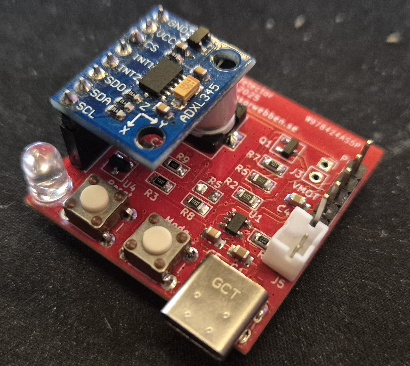
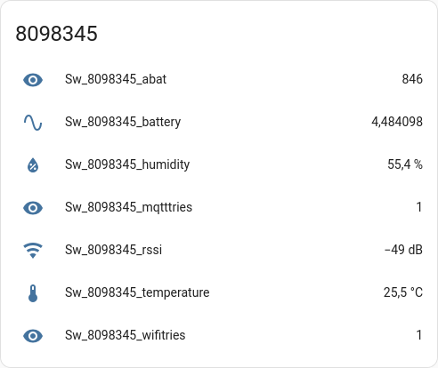

# Sensorwebben Device Documentation

## Table of Contents
- [Overview](#overview)
- [Prerequisites](#prerequisites)
- [How It Works](#how-it-works)
- [Software](#software)
- [Hardware and Sensor Products](#hardware-and-sensor-products)
- [Future Plans](#future-plans)
- [Additional Resources](#additional-resources)

This repository contains complete open-source designs for IoT sensor devices, including both firmware and hardware (PCB layouts, circuit diagrams, and enclosure designs). The devices are built around ESP8266/ESP32 microcontrollers and integrate seamlessly with Home Assistant via MQTT.

**Target Audience**: Makers, embedded developers, and Home Assistant enthusiasts who want to build custom sensor devices or understand IoT sensor design.

**Key Features**: Modular architecture, automatic Home Assistant discovery, deep sleep power management, web-based configuration, and support for multiple sensor types.

The project prioritizes open-source tools and libraries to ensure accessibility and avoid vendor lock-in. Development environment:

* **PlatformIO** (VS Code extension) - Embedded development environment
* **KiCad 9.0.6** - PCB design and schematic capture
* **FreeCAD 1.0.2** - 3D enclosure design
* **Git** - Version control and collaboration

If you have suggestions for improvements, please consider contributing via pull-requests, opening an issue or contact me via pm or email.

If you like the project and want to support it, consider donating a small amount via [PayPal](https://www.paypal.com/donate/?business=6X9PRDMLYC4NN&no_recurring=1&currency_code=SEK) or buy a hardware-device from [Sensorwebben.se](https://www.sensorwebben.se).

> **💡 Tip**  
> 
>
> **[PCBWay](https://www.pcbway.com/)** kindly supported this project by manufacturing the first batch of the soon coming CatActivityDetector PCBs. Please visit their site if you need PCB manufacturing or assembly services. There are lots of options for low-cost prototyping and small series production.
>
> PCB by: PCBWay,   
> Assembly by: Sensorwebben.se
>
> 

## Overview

### Supported Features

* **Sensor Integration**: DHT11/DHT22 (temperature/humidity), HX711 (precision weight), I2C sensors
* **Home Assistant Integration**: Automatic device discovery via MQTT with retained configuration messages
* **Dual Communication Modes**: Local MQTT or remote via Nabu Casa webhooks
* **Web-based Configuration**: Captive portal setup for WiFi, MQTT, and device parameters
* **Power Management**: Configurable deep sleep cycles for battery operation
* **Error Handling**: Visual LED feedback and comprehensive serial logging

### Architecture

Built on PlatformIO and Arduino framework with clean separation of concerns:

* **Modular sensor interface** - Easy to add new sensor types
* **Publisher abstraction** - Supports multiple communication backends
* **Configuration management** - Persistent storage with factory reset capability
* **State machine design** - Reliable mode switching and error recovery

## Prerequisites

### For End Users

Before deploying sensor devices, ensure you have:

1. **WiFi Network**: Stable 2.4GHz WiFi coverage at deployment location
2. **Home Assistant**: Running instance with MQTT integration enabled
3. **MQTT Broker**: Mosquitto or similar (often bundled with Home Assistant)

For more details on Home Assistant, visit: [Home Assistant](https://www.home-assistant.io/).

## How It Works

### Device Operation Modes

The firmware implements a state machine with two primary operational modes:

#### Configuration Mode (Setup)
* **Access Point**: Creates WiFi hotspot for initial setup
* **Captive Portal**: Web interface for WiFi credentials, MQTT broker settings, and device parameters
* **Discovery**: Sends Home Assistant MQTT discovery messages with device metadata
* **Validation**: Tests connectivity before saving configuration

#### Standard Mode (Operation)
* **Boot Sequence**: Validates stored configuration and establishes connections
* **Sensor Loop**: Periodic wake → measure → publish → sleep cycle
* **Deep Sleep**: Configurable intervals for power efficiency
* **Error Recovery**: Automatic retry logic with exponential backoff

#### Error Indication (in std mode)

The red LED blinks to indicate errors:

* **2 blinks**: WiFi connection failed.
* **3 blinks**: MQTT connection failed.
* **4+ blinks**: Internal error (check serial output for details).

### MQTT Communication Protocol

#### Discovery Messages (Setup Phase)

* **Topic Structure**: `homeassistant/sensor/{device_id}/{entity}/config`
* **Retained**: Yes - ensures Home Assistant rediscovers devices after restarts
* **Content**: Device metadata, entity definitions, and availability topics
* **Triggered**: During initial setup and factory reset

#### State Messages (Operational)

* **Topic Structure**: `homeassistant/sensor/{device_id}/{entity}/state`
* **Retained**: No - real-time sensor data
* **Format**: JSON payload with sensor readings and metadata
* **Frequency**: Configurable (default: every 60 seconds)

#### Availability Monitoring

* **Topic**: `{device_topic}/availability`
* **Payloads**: "online"/"offline" for connection status tracking
* **Last Will**: Automatic "offline" message on unexpected disconnection

## Software

The firmware is built using modern embedded development practices with PlatformIO and Arduino framework. The code features modular architecture, clean interfaces, and support for multiple hardware platforms.

**Key Software Features**:
* Modular sensor and publisher interfaces
* Multiple build environments for different hardware variants  
* Automatic dependency management
* Comprehensive device support (ESP8266/ESP32)

For detailed software documentation, build instructions, and development information, see the [Software Documentation](sw/).

## Hardware and sensor products

Here you will find product documentation for hardware using this software. More hardware designs will be added in the future.

All hardware designs are made using KiCad and the design files are included in the `hw` directory of the project. Each sensor-type has its own subdirectory with PCB layouts, circuit diagrams, and enclosure designs. 

### Sensorwebben Misto
The Misto is a compact environmental sensor device designed for indoor use. It is built around the ESP8266 microcontroller and provides wireless connectivity for home automation and environmental monitoring applications.
This device uses the z_main_misto* firmware configurations of this software.
[Misto Documentation](hw/misto/)

## Future Plans (some)

* Add support for more sensors and hardware features.
* Design and implement more types of sensors-products
* Add a USB-C port for external power and programming without the need of a separate programmer.

## Additional Resources

* [Discovery Message Documentation](doc/discovery_msg.md)
* [Publish Message Documentation](doc/publish_msg.md)
* [Example of remote automation for a web-hook](doc/remote-automation.yaml)
* [Home Assistant - Open source home automation platform](https://www.home-assistant.io/)
* [Nabu Casa - Home Assistant Cloud Service](https://www.nabucasa.com/)
* [Sensorwebben - open source sensors for home automation](https://www.sensorwebben.se)

## Some suppliers I use for this project
* [Aisler - PCB manufacturing service in EU](https://www.aisler.net)
* [PCBWay - PCB manufacturing service worldwide](https://www.pcbway.com/)
* [Electrokit - Electronics components store in Sweden](https://www.electrokit.se/)
* [DigiKey - Electronics components store worldwide](https://www.digikey.com/)