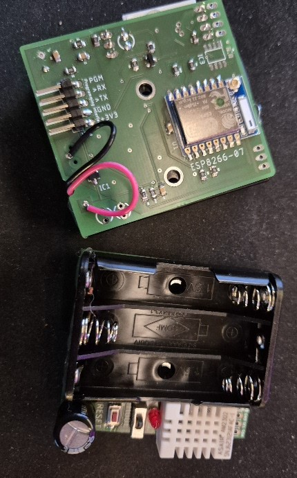
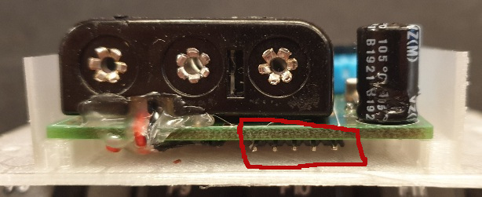

# Misto - Environmental Sensor Device

## Table of Contents
- [Overview](#overview)
- [Hardware Specifications](#hardware-specifications)
- [Key Features](#key-features)
- [Technical Specifications](#technical-specifications)
- [Use Cases](#use-cases)
- [Programming Interface](#programming-interface)
- [References and Design Files](#references-and-design-files)

---

The Misto is a compact, battery-powered environmental monitoring device designed for long-term indoor deployment. Built around the ESP8266 microcontroller, it provides wireless connectivity for home automation and environmental monitoring applications through MQTT integration with Home Assistant.

**Key Characteristics**: Ultra-low power design, wireless configuration, automatic discovery, and robust battery operation with 6+ month lifespan.

All hardware and software designs are open-source and available in this repository for building custom Misto devices or as inspiration for other IoT projects.

## Overview

Misto is a battery-powered IoT sensor platform optimized for long-term environmental monitoring. The device measures temperature, humidity, and battery status, with intelligent power management enabling months of autonomous operation.

**Primary Features**:
* Environmental sensing (temperature, humidity)
* Battery voltage and RSSI monitoring  
* MQTT communication with Home Assistant auto-discovery
* Web-based configuration portal
* Deep sleep power management

**Target Applications**: Indoor climate monitoring, smart home integration, energy-efficient data logging, and remote environmental sensing.

## Hardware Specifications

### Microcontroller Platform
* **MCU**: ESP8266-07
* **Flash**: 4MB SPI flash memory
* **RAM**: 80KB user data RAM
* **Connectivity**: WiFi 802.11 b/g/n (2.4GHz)
* **Power Modes**: Active, light sleep, deep sleep 

### Sensor Subsystem
* **Environmental**: DHT22 (temperature ±0.5°C, humidity ±2% RH)
* **Power Monitoring**: ADC-based battery voltage measurement
* **Signal Quality**: WiFi RSSI reporting
* **Update Rate**: Configurable 

### Power Management
* **Supply**: 3x AAA batteries (4.5V nominal)
* **Regulation**: Onboard 3.3V LDO with low dropout
* **Sleep Current**: <20µA in deep sleep mode
* **Active Current**: ~80mA during WiFi transmission
* **Battery Life**: 6-12 months (depends on reporting interval)

### Physical Interface
* **Programming**: 5-pin header (3V3, GND, TX, RX, PGM)
* **Indicators**: Status LED for configuration and error states
* **Enclosure**: 3D-printed protective housing

## Key Features

### Smart Power Management
The device implements intelligent power management through:

* Configurable sleep intervals (minutes to hours)
* Automatic sensor power control
* Battery voltage monitoring with low-battery alerts
* Deep sleep mode between measurements

### Easy Configuration
* WiFi credentials and setup through web-portal, accessible via WiFi
* No programming required for basic operation
* Configurable MQTT broker settings

### Home Assistant Integration
* Automatic device discovery
* Real-time sensor data reporting
* Battery status monitoring
* Signal strength reporting
* Customizable measurement intervals

### Robust Operation
* Automatic WiFi reconnection
* MQTT connection retry logic
* Error indication through LED feedback

## Technical Specifications

| Parameter | Specification |
|-----------|---------------|
| Operating Voltage | 3.3V (regulated from 3x AAA batteries) |
| Supply Range | 2.7V - 4.5V (battery voltage) |
| Temperature Range | -40°C to +80°C (sensor), 0°C to +50°C (operation) |
| Humidity Range | 0-100% RH (±2% accuracy) |
| Temperature Accuracy | ±0.5°C (DHT22) |
| WiFi Standards | 802.11 b/g/n (2.4GHz only) |
| Communication | MQTT over WiFi |
| Battery Type | 3x AAA (alkaline, NiMH, lithium compatible) |
| Battery Life | 6-12 months (dependent on reporting interval) |
| Sleep Current | <20µA (deep sleep) |
| Active Current | ~80mA (WiFi active) |
| Dimensions | TBD (with enclosure) |
| Operating Temperature | -20°C to +50°C |
| Storage Temperature | -20°C to +70°C |

## Use Cases

* Indoor climate monitoring
* Home automation sensor networks
* Energy-efficient environmental logging
* Remote monitoring applications
* Smart home integration projects

## Programming Interface

Misto features a 5-pin programming header for firmware updates and development. The pinout (left to right) is:

| Pin | Signal | Description |
|-----|--------|-------------|
| 1 | +3V3 | 3.3V power supply (use only when batteries are removed) |
| 2 | GND | Ground reference |
| 3 | TX | UART transmit (connect to programmer's RX) |
| 4 | RX | UART receive (connect to programmer's TX) |
| 5 | PGM | Programming mode (pull to GND during reset for flash mode) |

### Programming Procedure

1. **Remove batteries** before connecting external power
2. Connect UART programmer (3.3V logic levels)
3. **For flashing**: Hold PGM pin to GND, then power-on or reset
4. **For monitoring**: Normal power-on without PGM connection
5. Use 115200 baud, 8N1 for serial communication

**Important**: Never apply external 3V3 power while batteries are installed.

## References and Design Files

This section provides access to hardware design files and documentation for the Misto environmental sensor device.

**Note**: The original Misto was designed using proprietary tools before adopting KiCad. A new open-source version with complete KiCad design files is in development and will be released soon.

### Current Design Files

#### Electrical Design
* [Misto Schematic (PDF)](misto_circuit.pdf) - Complete electrical schematic diagram
* **PCB Files**: Not yet available in open-source format
* **PCB Ordering**: Available through [Aisler PCB service](https://aisler.net/p/QNSKHTQB)

#### Mechanical Design  
* [Enclosure Design Files (ZIP)](misto-box-FreeCad.zip) - FreeCAD source files for 3D-printed enclosure

### Manufacturing Information

The provided design files enable:

* 3D printing of protective enclosures
* Understanding of electrical design for custom variations
* Reference for developing compatible devices

**Licensing**: All design files are provided under open-source licensing terms.