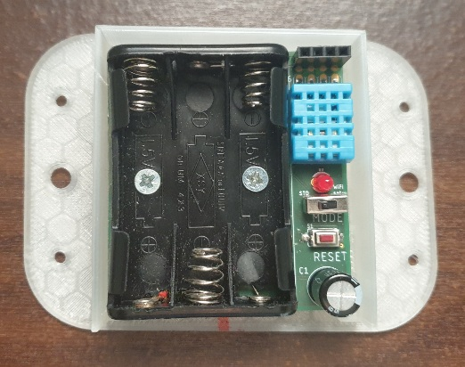
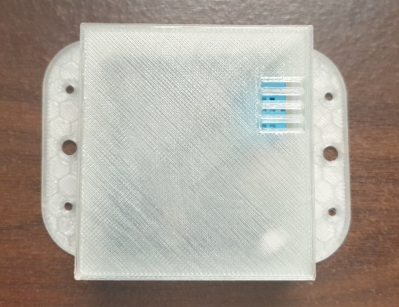

## The sensor-device software

This project contains the software for a sensor-device built with ESP8266.

The hardware is sold by www.sensorwebben.se but the circuit-diagram is included in this project for reference.

In the basic-configuration (shown below without the cover) the sensor-device is powered by 3xAAA and equiped with a DHT11 that measures temperature and humidity and works for indoor use. 

The pcb has also a connection for I2C and any I2C-sensor can by used if the software is updated with support.

The hardware also have optional support for DHT22 or a Dallas one-wire replacing the DHT11. Other hardware that can be added on the pcb is a HSM-circuit and also a LiPo-charger and a connector for use with rechargeble LiPo batteries instead of 3xAAA.

### The sensor-device's way of working
There are 2 differnet 'modes' controlled by the switch om the PCB

#### 1: WiFi configuration mode
In this mode the sensor-device creates an accesspoint and starts a webserver where you can configure the wifi to use.

#### 2: Normal mode
In this mode the sensor connects to the configured wifi, gets the settings-file from sensorwebben.se and then starts a meassuring cycle with the parameters from the settings-file.

### The development environment
I use Visual Studio Code with PlatformIO extension but any Arduino type of enviroment should work.

####  Good to know for dev

To make serial work witout root: 
sudo usermod -a -G tty psk
sudo usermod -a -G dialout psk

To find python3 in platformio: 
sudo apt install -y python3-venv 

### The basic functions

Settings are received each cycle from the backend in form of a simple json-file. 

Each measuring-cycle this things are measured and sent back as defined in the config file:

* WiFi connection atempts to connect
* WiFi signal strenght
* Battery voltage-level
* Temperature
* Humidity

The software then puts the ESP in deep-sleep for the time defined in the settingsfile, the restarts for a new cycle. However, the accurancy in the sleep-time is not that high... 

