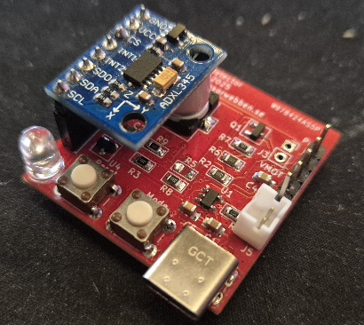

:toc:
:toc-title: Table of Contents
:toc-placement: preamble

= Sensorwebben Device Documentation

This repository contains both the software for sensor-devices developed by link:https://www.sensorwebben.se[Sensorwebben.se] using ESP8266 or ESP32 microcontrollers but also their hardware designs (PCB layouts and circuit diagrams).

The software and hardware are open-sourced and the repo can be used for building your own sensor-devices or get inspiration for other projects. 

I have tried to use only open-source libraries and tools to make it easy to modify and extend the software without vendor lock-in or expensive licenses. I use Linux Ubuntu 22.04.5 LTS and the following tools:

* Visual studio code with PlatformIO extension is used as development environment for the software.
* KiCad is used for designing the hardware (version 8.0.9)
* FreeCad is used for designing the enclosures (version 1.0.2)
* Shotcut is used for video editing (version 25.11.2)
* Gimp is used for image editing (version 3.0.6)

I also use these (non-free) ai-tools:

* ChatGPT premium
* Github copilot

If you have suggestions for improvements, please consider contributing via pull-requests, opening an issue or contact me via pm or email.

If you like the project and want to support it, consider donating a small amount via link:https://www.paypal.com/donate/?business=6X9PRDMLYC4NN&no_recurring=1&currency_code=SEK[PayPal] or buy a hardware-device from link:https://www.sensorwebben.se[Sensorwebben.se].

[TIP]
====
image:doc/pcbway-logo.png[PcbWay,100,link=https://www.pcbway.com/]

*link:https://www.pcbway.com/[PCBWay]* kindly supported this project by manufacturing the first batch of the soon comming CatActivityDetector PCBs. Please visit their site if you need PCB manufacturing or assembly services. There are lots of options for low-cost prototyping and small series production.

PCB by: PCBWay,   
Assembly by: Sensorwebben.se

====

== Overview

The software supports:

* Interfacing with sensors like DHT11, DHT22, and HX711 (weight-scale).
* Local communication with Home Assistant via MQTT (this is the main use-case).
* Configuration and testing of new hardware using a setup software.
* Option: the software can be set up to communicate remotely with Home Assistant via Nabu Casa web-hooks and MQTT trigger automation 

When bying a sensor-device from Sensorwebben.se, the local communicating software is pre-installed and ready to use. You only need to configure it via the web-portal that the device creates in configuration mode.

The software is built using the PlatformIO build system and the Arduino framework, making it modular and extensible for adding new sensors and features.

== Software Types

The software is divided into four main configurations for each sensor-type:

1. **real-local**: For local communication with Home Assistant via MQTT.
2. **real-remote**: For remote communication with Home Assistant via Nabu Casa web-hooks.
3. **setup-local**: For testing and configuring new hardware with local communication.
4. **setup-remote**: For testing and configuring new hardware with remote communication.

== Features

* **Sensor Support**: DHT11, DHT22, HX711 and I2C sensors.
* **Power Management**: Deep sleep cycles with configurable intervals.
* **Error Indication**: LED blinks to indicate errors (e.g. WiFi or MQTT connection issues).
* **Modular Design**: Uses `Sensor` and `Publisher` interfaces for extensibility.

== Prerequisites

These are the prerequisites for using the devices from sensorwebben.se. Make sure these are fulfilled before bying or building a sensor-device. 

1. **WiFi Coverage**: You need good enough wifi reception for the sensor device to connect to your WiFi network.
2. **Home Assistant**: You need a working Home Assistant installation to receive and show the data.
3. **MQTT Server**: You need an MQTT server (e.g. Mosquitto) in your Home Assistant setup for automatic device discovery and integration.

For more details on Home Assistant, visit: link:https://www.home-assistant.io/[Home Assistant].

== How It Works

The sensor device operates in two modes, controlled by a switch.

=== 1. Configuration Mode

* **Local Software**: Creates an access point and web server for configuring WiFi, MQTT server, and other parameters.
* **Remote Software**: Uses predefined parameters from `boxsecrets.cpp` for remote connection to Home Assistant via Nabu Casa.

In both cases, the device sends configuration messages to Home Assistant and automatically sets up sensors and entities.

=== 2. Standard Mode 
* Connects to the configured WiFi and MQTT server.
* Measures sensor data in cycles with deep sleep intervals.
* Publishes data to Home Assistant.

==== Error Indication (in std mode)
The red LED blinks to indicate errors:

* **2 blinks**: WiFi connection failed.
* **3 blinks**: MQTT connection failed.
* **4+ blinks**: Internal error (check serial output for details).

=== Messaging
The device sends two types of messages to Home Assistant:

1. **Discovery Messages**: Sent during setup to configure the sensor as a 'device' in Home Assistant with 'retain' set to true.
2. **Publish Messages**: Sent during normal operation to report data from the sensors 'entities'.

When configured correctly from the webportal of the sensor-device, the sensor values shows up directly in Home Assistant default view and could be used in dashboards immediately.

image:doc/ha-added-sensor-w-first-values.png[Home Assistant Added Sensor with First Values]

== Software

The software uses two main interfaces:

1. **Sensor Interface**: Implemented by all sensor classes. Defines methods for initialization and data retrieval. Adding a new sensor involves creating a class that implements this interface.
2. **Publisher Interface**: Implemented by classes responsible for publishing data (e.g., MQTT). Defines methods for connecting to servers and sending data.

=== Implemented Sensor-types
*  **DHT11/DHT22**: Supports DHT11/DHT22 sensors using the Adafruit DHT library.
*  **Hx711**: Supports HX711 weight-scale sensors

=== Implemented Publishers
* **MqttPublisher**: Publishes data to a local MQTT server.
* **HaRemoteClient**: Publishes data to a remote Home Assistant instance via Nabu Casa web-hooks.

== Development Environment

The project uses Visual Studio Code with the PlatformIO extension. The software is written in C++ and structured for modularity and extensibility.

The project includes a `platformio.ini` file for configuring the build environment. The software is built using the Arduino framework, which provides a simple and efficient way to develop applications for ESP8266 and ESP32 microcontrollers.
The project is organized into several directories:

* **src**: Contains the main source code for the project.
* **include**: Contains header files for the project.
* **lib**: Contains external libraries used in the project.
* **test**: Contains unit tests for the project (not implemented yet).
* **doc**: Contains documentation files for the project.
* **hw**: Contains some hardware design files (PCB layouts, circuit diagrams, enclosure designs). More to come in the near future.
* **README.md**: Contains the main documentation for the project.
* **LICENSE**: Contains the license information for the project.
* **platformio.ini**: Contains the configuration for the PlatformIO build system.

=== How to use the different environments

The project defines multiple environments in the `platformio.ini` file to simplify building and uploading firmware for different hardware and use cases. Each environment corresponds to a specific configuration of the ESP8266 or ESP32 microcontroller.

To select an environment from the platformio gui, open the PlatformIO extension in Visual Studio Code and select the desired environment from the drop-down menu at the bottom. 

== Hardware and sensor products

Here you will find product documentation for hardware using this software. More hardware designs will be added in the future.

All hardware designs are made using KiCad and the design files are included in the `hw` directory of the project. Each sensor-type has its own subdirectory with PCB layouts, circuit diagrams, and enclosure designs. 

=== Sensorwebben Misto
The Misto is a compact environmental sensor device designed for indoor use. It is built around the ESP8266 microcontroller and provides wireless connectivity for home automation and environmental monitoring applications.
This device uses the z_main_misto* firmware configurations of this software.
link:hw/misto/misto.adoc[Misto Documentation]

== Future Plans (some)

* Add support for more sensors and hardware features.
* Design and implement more types of sensors-products
* Add a USB-C port for external power and programming without the need of a separate programmer.

== Additional Resources

* link:doc/discovery_msg.adoc[Discovery Message Documentation]
* link:doc/publish_msg.adoc[Publish Message Documentation]
* link:doc/remote-automation.yaml[Example of remote automation for a web-hook]
* link:https://www.home-assistant.io/[Home Assistant - Open source home automation platform]
* link:https://www.nabucasa.com/[Nabu Casa - Home Assistant Cloud Service]
* link:https://www.sensorwebben.se[Sensorwebben - open source sensors for home automation]
* link:https://www.aisler.net[Aisler - PCB manufacturing service in EU]
* link:https://www.pcbway.com/[PCBWay - PCB manufacturing service]
* link:https://www.electrokit.se/[Electrokit - Electronics components store in Sweden]