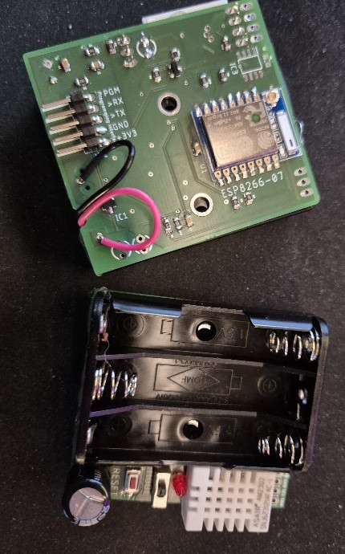

= Sensorwebben Software Documentation

:toc:
:toc-title: Table of Contents
:toc-placement: auto

This repository contains the software for sensor devices developed by Sensorwebben.se. The software is designed to run on ESP8266 and ESP32 microcontrollers, enabling communication with Home Assistant via MQTT or Nabu Casa web-hooks.

== Overview

The software supports:

* Interfacing with sensors like DHT11, DHT22, and HX711 (weight-scale).
* Local communication with Home Assistant via MQTT.
* Remote communication with Home Assistant via Nabu Casa web-hooks and MQTT trigger automation.
* Configuration and testing of new hardware using setup software.

The software is built using the PlatformIO build system and the Arduino framework, making it modular and extensible for adding new sensors and features.

== Software Types

The software is divided into four main configurations for each microcontroller (ESP8266 and ESP32):

1. **real-local**: For local communication with Home Assistant via MQTT.
2. **real-remote**: For remote communication with Home Assistant via Nabu Casa web-hooks.
3. **setup-local**: For testing and configuring new hardware with local communication.
4. **setup-remote**: For testing and configuring new hardware with remote communication.

In the future, the setup-local and setup-remote configurations will be merged into a single setup software.

== Features

* **Sensor Support**: DHT11, DHT22, HX711, and other I2C sensors.
* **Power Management**: Deep sleep cycles with configurable intervals.
* **Error Indication**: LED blinks to indicate errors (e.g., WiFi or MQTT connection issues).
* **Modular Design**: Uses `Sensor` and `Publisher` interfaces for extensibility.

== Prerequisites

1. **WiFi Coverage**: Ensure the sensor device can connect to your WiFi network.
2. **MQTT Server**: Install and configure an MQTT server (e.g., Mosquitto) in your Home Assistant setup.
3. **Home Assistant**: A working Home Assistant installation is required for automatic device discovery and integration.

For more details on Home Assistant, visit: link:https://www.home-assistant.io/[Home Assistant].

== How It Works

The sensor device operates in two modes, controlled by a switch on the PCB:

=== 1. Configuration Mode (Switch Away from Batteries)

* **Local Software**: Creates an access point and web server for configuring WiFi, MQTT server, and other parameters.
* **Remote Software**: Uses predefined parameters from `boxsecrets.cpp` for remote connection to Home Assistant via Nabu Casa.

In both cases, the device sends configuration messages to Home Assistant, automatically setting up sensors and entities.

=== 2. Standard Mode (Switch Towards Batteries)
* Connects to the configured WiFi and MQTT server.
* Measures sensor data in cycles with deep sleep intervals.
* Publishes data to Home Assistant.

==== Error Indication
The red LED blinks to indicate errors:

* **2 blinks**: WiFi connection failed.
* **3 blinks**: MQTT connection failed.
* **4+ blinks**: Internal error (check serial output for details).

== Hardware

=== PCB
The PCB is designed for DHT11/DHT22 sensors and includes connectors for:

* I2C sensors.
* Dallas one-wire sensors.
* HSM circuits (via I2C).
* LiPo charger and batteries (optional).

=== Programming Interface
The PCB has a 5-pin programming interface:

1. **+3V3**: Use only without batteries installed.
2. **GND**
3. **TX**: Connect to the programmer's TX pin.
4. **RX**: Connect to the programmer's RX pin.
5. **PGM**: Connect to GND for programming mode before flashing firmware.

image:doc/programming-interface.jpg[Programming Interface]

=== Circuit Diagram
The circuit diagram for the ESP8266 sensor is included in the project: link:doc/circuit.pdf[Circuit Diagram].

== Software Architecture

The software uses two main interfaces:

1. **Sensor Interface**: Implemented by all sensor classes. Defines methods for initialization and data retrieval. Adding a new sensor involves creating a class that implements this interface.
2. **Publisher Interface**: Implemented by classes responsible for publishing data (e.g., MQTT). Defines methods for connecting to servers and sending data.

=== Implemented Sensors
* **DhtSensor**: Supports DHT11 and DHT22 sensors using the Adafruit DHT library.
* **Hx711Sensor**: Supports HX711 weight-scale sensors.

=== Implemented Publishers
* **MqttPublisher**: Publishes data to a local MQTT server.
* **HaRemoteClient**: Publishes data to a remote Home Assistant instance via Nabu Casa web-hooks.

== Development Environment

The project uses Visual Studio Code with the PlatformIO extension. The software is written in C++ and structured for modularity and extensibility.

== Future Plans

* Merge local and remote setup software into a single configuration.
* Add support for more sensors and hardware features.
* Provide additional design files for hardware.

== Additional Resources

* link:discovery_msg.adoc[Discovery Message Documentation]
* link:publish_msg.adoc[Publish Message Documentation]
* link:https://www.home-assistant.io/[Home Assistant]