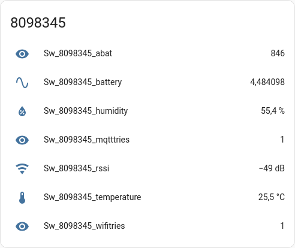

:toc:
:toc-title: Table of Contents
:toc-placement: preamble

= Sensorwebben Device Documentation

This repository contains the software for sensor devices developed by Sensorwebben.se. The software is designed to run on ESP8266 or ESP32 microcontrollers, enabling communication with Home Assistant via local MQTT or remote Nabu Casa web-hooks.

Pre-built hardware is available for purchase on the Sensorwebben.se website but the information in this repository can also be used for building your own device.

== Overview

The software supports:

* Interfacing with sensors like DHT11, DHT22, and HX711 (weight-scale).
* Local communication with Home Assistant via MQTT.
* Remote communication with Home Assistant via Nabu Casa web-hooks and MQTT trigger automation.
* Configuration and testing of new hardware using a setup software.

The software is built using the PlatformIO build system and the Arduino framework, making it modular and extensible for adding new sensors and features.

== Software Types

The software is divided into four main configurations for each sensor-type:

1. **real-local**: For local communication with Home Assistant via MQTT.
2. **real-remote**: For remote communication with Home Assistant via Nabu Casa web-hooks.
3. **setup-local**: For testing and configuring new hardware with local communication.
4. **setup-remote**: For testing and configuring new hardware with remote communication.

In the future, the local and remote configurations will be merged into a single software.

== Features

* **Sensor Support**: DHT11, DHT22, HX711 and I2C sensors.
* **Power Management**: Deep sleep cycles with configurable intervals.
* **Error Indication**: LED blinks to indicate errors (e.g. WiFi or MQTT connection issues).
* **Modular Design**: Uses `Sensor` and `Publisher` interfaces for extensibility.

== Prerequisites

1. **WiFi Coverage**: Ensure the sensor device can connect to your WiFi network.
2. **Home Assistant**: A working Home Assistant installation is required for automatic device discovery and integration.
3. **MQTT Server**: Install and configure an MQTT server (e.g., Mosquitto) in your Home Assistant setup.

For more details on Home Assistant, visit: link:https://www.home-assistant.io/[Home Assistant].

== How It Works

The sensor device operates in two modes, controlled by a switch.

=== 1. Configuration Mode

* **Local Software**: Creates an access point and web server for configuring WiFi, MQTT server, and other parameters.
* **Remote Software**: Uses predefined parameters from `boxsecrets.cpp` for remote connection to Home Assistant via Nabu Casa.

In both cases, the device sends configuration messages to Home Assistant, automatically setting up sensors and entities.

=== 2. Standard Mode 
* Connects to the configured WiFi and MQTT server.
* Measures sensor data in cycles with deep sleep intervals.
* Publishes data to Home Assistant.

=== Error Indication
The red LED blinks to indicate errors:

* **2 blinks**: WiFi connection failed.
* **3 blinks**: MQTT connection failed.
* **4+ blinks**: Internal error (check serial output for details).

=== Messaging
The device sends two types of messages to Home Assistant:

1. **Discovery Messages**: Sent during setup to configure the sensor as a 'device' in Home Assistant.
2. **Publish Messages**: Sent during normal operation to report data from the sensors 'entities'.

When configured correctly from the webportal of the sensor-device, the sensor values shows up directly in Home Assistant default view and could be used in dashboards immediately.

== Software

The software uses two main interfaces:

1. **Sensor Interface**: Implemented by all sensor classes. Defines methods for initialization and data retrieval. Adding a new sensor involves creating a class that implements this interface.
2. **Publisher Interface**: Implemented by classes responsible for publishing data (e.g., MQTT). Defines methods for connecting to servers and sending data.

=== Implemented Sensor-types
*  **DHT11/DHT22**: Supports DHT11/DHT22 sensors using the Adafruit DHT library.
*  **Hx711**: Supports HX711 weight-scale sensors

=== Implemented Publishers
* **MqttPublisher**: Publishes data to a local MQTT server.
* **HaRemoteClient**: Publishes data to a remote Home Assistant instance via Nabu Casa web-hooks.

== Development Environment

The project uses Visual Studio Code with the PlatformIO extension. The software is written in C++ and structured for modularity and extensibility.

The project includes a `platformio.ini` file for configuring the build environment. The software is built using the Arduino framework, which provides a simple and efficient way to develop applications for ESP8266 and ESP32 microcontrollers.
The project is organized into several directories:

* **src**: Contains the main source code for the project.
* **include**: Contains header files for the project.
* **lib**: Contains external libraries used in the project.
* **test**: Contains unit tests for the project.
* **doc**: Contains documentation files for the project.
* **README.md**: Contains the main documentation for the project.
* **LICENSE**: Contains the license information for the project.
* **platformio.ini**: Contains the configuration for the PlatformIO build system.

=== How to use the different environments

The project defines multiple environments in the `platformio.ini` file to simplify building and uploading firmware for different hardware and use cases. Each environment corresponds to a specific configuration of the ESP8266 or ESP32 microcontroller.

To select an environment from the platformio gui, open the PlatformIO extension in Visual Studio Code and select the desired environment from the drop-down menu. 

Alternatively, you can use the command line to build and upload firmware for a specific environment.

To build for a specific environment, use the PlatformIO command:

    pio run -e <environment>

To upload firmware to your device, use:

    pio run -e <environment> -t upload

Replace `<environment>` with the desired environment name from above.

== Hardware

=== Sensorwebben Misto PCB
The PCB is designed for the 'Misto' sensor and uses ESP8266 and a DHT11/DHT22 sensor but includes optional footprints and connectors for:

* I2C sensors
* Dallas one-wire sensors
* HSM circuits (via I2C) 
* LiPo charger and batteries

image:doc/hardware.jpg[ESP8266 PCB without enclosure]

=== Sensorwebben ApiScale PCB
The PCB is designed for DHT11/DHT22 and HX711 weight-scale sensors and includes optional footprints and connectors for:

* I2C sensors
* Dallas one-wire sensors
* LiPo charger and batteries

=== Programming Interface
Both the ESP8266 and ESP32 PCB has a 5-pin programming interface with the same 'pinning'. The pinout is as follows and the picture shows the ESP8266 variant

1. **+3V3**: Use only without batteries installed.
2. **GND**: Connect to the programmer's GND pin.
3. **TX**: Connect to the programmer's TX pin.
4. **RX**: Connect to the programmer's RX pin.
5. **PGM**: Connect to GND for programming mode before flashing firmware.

image:doc/programming-interface.jpg[ESP8266 Programming Interface]

=== Circuit Diagram
The circuit diagram for the ESP8266 sensor is included in the project: link:doc/circuit.pdf[Circuit Diagram]. The circuit diagram for ESP32 will soon be available.

== Future Plans

* Merge local and remote setup-software into a single configuration.
* Merge local and remote real-software into a single configuration. This needs refactoring of the publisher-interface
* Add support for more sensors and hardware features.
* Provide additional design files for hardware.

== Additional Resources

* link:doc/discovery_msg.adoc[Discovery Message Documentation]
* link:doc/publish_msg.adoc[Publish Message Documentation]
* link:doc/remote-automation.yaml[Example of remote automation for a web-hook]
* link:https://www.home-assistant.io/[Home Assistant]
* link:https://www.nabucasa.com/[Nabu Casa]