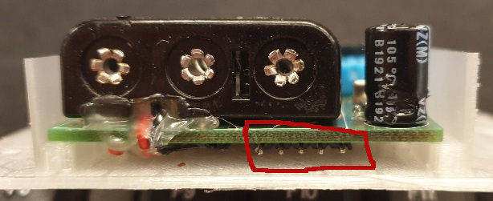

# The sensor-device

This is the developmnet-branch for sw version 3.x and is still a work in progress

v 3.0.0:

 * Generalized with software components that will be used by several main-configurations
 * Added support for remote connection to Nabu Casa via web-hook
 

This github-repo contains the software for a sensor-device built around ESP8266 using a DHT11 or DHT22.

The software runs on a pre-built hardware sold by www.sensorwebben.se but the 
link:doc/circuit.pdf[Circuit-diagram]
circuit-diagram is included in this project for reference. In the near future all other design-files will be available in the project as well.

The pre-built hardware has a connection for I2C and any I2C-sensor can by used if the software is updated with support.

The pre-built hardware also have optional support for a Dallas one-wire, replacing the DHTx. Other hardware that can be added on the pcb is a HSM-circuit connected via I2C and a LiPo-charger and a connector for use with rechargeble LiPo batteries instead of 3xAAA.

## Pre-requisites for using the sensor-device

You need WiFi coverage and an MQTT server in your network that recieves the data. The software is built and prepared for Home Assistant but will probably work for other setups as well but configuration out-of-the-box is now only supported for Home Assistant even if some topics can be changed in the parameters.

### Pre-requisites for Home Assistant
Before setting-up and using the sensors you need to have a working Home Assistant installation. In addition to this you need to install an MQTT server and configure it in Home Assistant. Mosquitto is a good choice for the MQTT server, use the default settings for the MQTT server in Home Assistant.

For more details on Home Assistant, visit: link:https://www.home-assistant.io/[Home Assistant]

## The sensor-device's way of working
There are 2 different 'modes' controlled by the switch on the PCB.

### 1: Configuration mode (switch away from the batteries)
In this mode the sensor-device creates an accesspoint and starts a webserver where you can configure the wifi to use and also other parameters like your mqtt-server,  measuring interval and topic.

When the sensor connects to the wifi after a successful configuration it will send configuration messages directed to Home Assistant that will automatically set up one 'device' with one 'sensor' for each of the entities sent from the sensor-device.

Example of the sensor-device added to homeassistant by the sensor-setup:

For more details, see the discovery message documentation: link:discovery_msg.adoc[Discovery Message]

### 2: STD mode (switch towards the batteries)
In this mode the sensor connects to the configured wifi and mqtt-server and starts meassuring in cycles with the deep-sleep period defined by the parameter in-between.

Example of the sensor-device added to homeassistant and sending values:

image:doc/ha-added-sensor-w-first-values.png[The sensor added to homeassistant by the sensor-setup]

For more details, see the publish message documentation: link:publish_msg.adoc[Publish Message]

#### Error indication (in std-mode)

If the red led blinks a couple of times in STD mode, something is wrong.

* 2 blink: the wifi-connection failed. Check your wifi-settings
* 3 blink: the mqtt-connection failed. Check your mqtt-settings 
* 4 or more: some internal error. Check the serial output for more info.

## The sensor-device software

The software is written in C++ and is built using the Arduino framework. The software is built using the PlatformIO build system but can be built using the Arduino IDE as well.

The source-code can be built in two different ways using the plattformio build system with environments. 

The two environments are: 

* real: for the real software that is used in the sensor-device 
* setup: for the setup software that is used for testing and setting up the software on a new built hardware for the first time

### The software structure

The software is structured in a way that makes it easy to add new sensors and new features. 
The software main and setup uses a few classes and interfaces, used as building-blocks in the code.

In platformio.ini there are two build-environments defined: `real` and `setup`. The `real` environment is used for the actual sensor-device, while the `setup` environment is used for the setup program. The setup program is used to configure the sensor-device and to test the hardware and software parts for a new hardware.

A settingsfile is used to store the settings for the sensor-device. The settingsfile is a JSON-file that contains all the settings for the sensor-device and the setup and main program uses this to use the correct implementaton of the classes and interfaces.

#### Interfaces

The software uses two main interfaces:

1. `Sensor`: This interface is implemented by all sensor classes. It defines the methods required to initialize the sensor and retrieve data from it. Adding support for a new sensor involves creating a new class that implements this interface.

2. `Publisher`: This interface is implemented by classes responsible for publishing data to external systems, such as MQTT. It defines methods for connecting to the server and sending data. To support a new publishing mechanism, create a class that implements this interface.

#### Currently implemented sensors
* DhtSensor: a wrapper for the DHT11 and DHT22 sensors. It uses the Adafruit DHT library to read data from the sensor. 

#### Currently implemented publishers

* MqttPublisher: publishing to a local MQTT-server. Typically used for the normal Home Assistant user and it is possible to configure via the web-portal when setting up the wifi-connection.
* HaRemoteClient: publishing to a remote server via https. Typically used to publish to a remote home-assistant instance via the NabuCasa cloud, VPN and a web-hook automation. This is not yet possible to configure via the webportal but is implemented in the code. To use this boxsecrets.cpp needs to be added with correct webhook-url and accesstoken for your home-assistant instance. It might be added to the configuration in the future

### The development environment
Visual Studio Code with PlatformIO extension is used for the project.

## The sensor-device hardware

### The PCB

image:doc/hardware.jpg[PCB without enclosure]

The PCB is designed to be used with a DHT11 or DHT22 sensor. The PCB has a connector for the sensor and an optional connector for the I2C-bus. The PCB also has a connector for a Dallas one-wire sensor. The PCB has a connector for a HSM-circuit connected via I2C and a LiPo-charger and a connector for use with rechargeble LiPo batteries instead of 3xAAA.

#### The programming interface

These 5 pins are the programming interface. From left:

* +3V3 (only use this WITHOUT batteries installed)
* GND
* Connect to TX of programmer
* Connect to RX of programmer
* Connect to GND to boot into programming-mode before flashing new firmware

#### The circuit diagram

The circuit link:doc/circuit.pdf[Circuit-diagram] is included in the project for reference. 